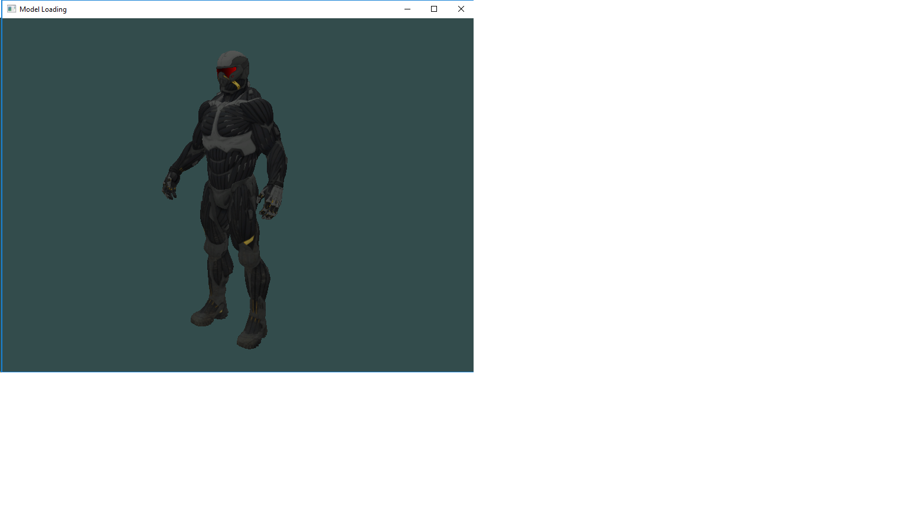

# learn OpenGL

Kotlin port of the tutorial of Joey De Vries: "Learn OpenGL" ([website](https://learnopengl.com/) and [repository](https://github.com/JoeyDeVries/LearnOpenGL))

 

How to get it running:

- clone
- synchronize Gradle
- run

Status:

- [x] Chapter 1, Getting Started
  - [x] 01, Hello Window
  - [x] 02, Hello Window Clear
  - [x] 03, Hello Triangle
  - [x] 04, Hello Triangle Indexed
  - [x] 05, Shaders Uniform
  - [x] 06, Shaders Interpolation
  - [x] 07, Shaders Class
  - [x] 08, Textures
  - [x] 09, Textures Combined
  - [x] 10, Transformations
  - [x] 11, Coordinate System
  - [x] 12, Coordinate System Depth
  - [x] 13, Coordinate System Multiple Objects
  - [x] 14, Camera Circle
  - [x] 15, Camera Keyboard Dt
  - [x] 16, Camera Mouse Zoom
  - [x] 17, Camera Class
- [ ] Chapter 2, Lighting
  - [x] 01, Colors
  - [x] 02, Basic Lighting Diffuse
  - [x] 03, Basic Lighting Specular
  - [x] 04, Materials
  - [x] 05, Lighting Maps Diffuse
  - [x] 06, Lighting Maps Specular
  - [ ] 07, Light Casters Directional
  - [ ] 08, Light Casters Point
  - [ ] 09, Light Casters Spot
  - [ ] 10, Light Casters Spot Soft
  - [ ] 11, Multiple Lights
- [ ] Chapter 3, Model Loading
- [ ] Chapter 4, Advanced OpenGL
- [ ] Chapter 5, Advanced Lighting
- [ ] Chapter 6, PBR
