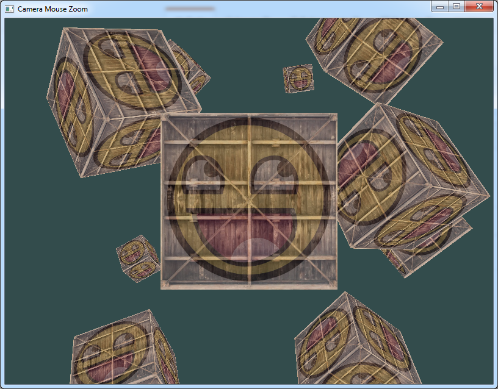

# learn-OpenGL

Kotlin port of the tutorial of Joey De Vries: "Learn OpenGL" ([website](https://learnopengl.com/) and [repository](https://github.com/JoeyDeVries/LearnOpenGL))

 

How to get it running:

- clone
- synchronize Gradle
- run

Status:

- [ ] Chapter 1, Getting Started
  - [x] Sample 01, Hello Window
  - [x] Sample 02, Hello Window Clear
  - [x] Sample 03, Hello Triangle
  - [x] Sample 04, Hello Triangle Indexed
  - [x] Sample 05, Shaders Uniform
  - [x] Sample 06, Shaders Interpolation
  - [x] Sample 07, Shaders Class
  - [x] Sample 08, Textures
  - [x] Sample 09, Textures Combined
  - [x] Sample 10, Transformations
  - [x] Sample 11, Coordinate System
  - [x] Sample 12, Coordinate System Depth
  - [x] Sample 13, Coordinate System Multiple Objects
  - [x] Sample 14, Camera Circle
  - [x] Sample 15, Camera Keyboard Dt
  - [x] Sample 16, Camera Mouse Zoom
- [ ] Chapter 2, Lighting
- [ ] Chapter 3, Model Loading
- [ ] Chapter 4, Advanced OpenGL
- [ ] Chapter 5, Advanced Lighting
- [ ] Chapter 6, PBR
